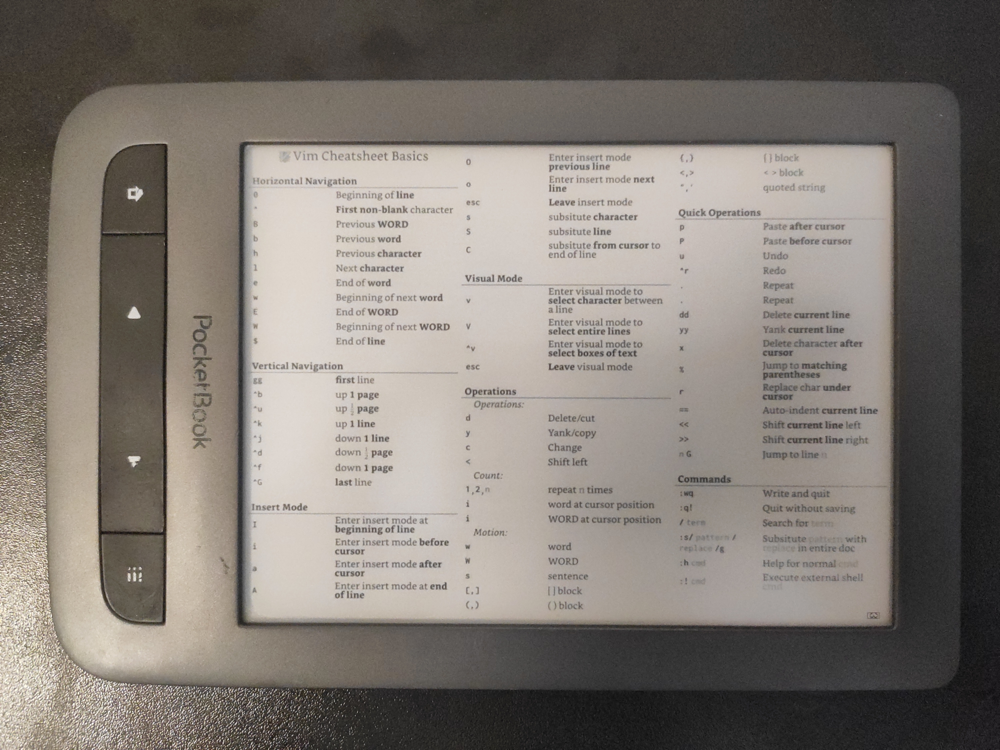
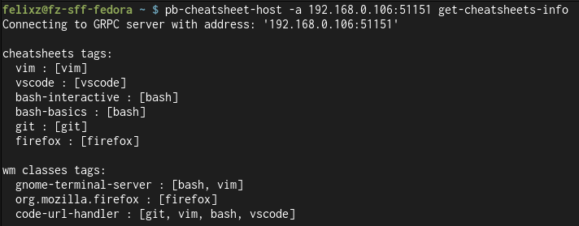

# pb-cheatsheet

Use a pocketbook device to display cheatsheet's (images) depending on the current focused window.

Currently only support for Gnome desktops is implemented.

# Showcase





# Prerequisites

First, install needed dependencies and set up the build:

```bash
just prerequisites
```

To see all available commands run:

```bash
just --list
```

# Installation

## Client

Connect the pocketbook device to your host.
Build and transfer the pocketbook client application by running:

```bash
just pb_sdk_version=<sdk-version> transfer-pb-client-usb
```

The app will now appear in the pocketbook application menu.
Launch it for it to wait for messages by the host.

## Host

Install the [focused-window-dbus](https://github.com/flexagoon/focused-window-dbus) gnome-shell extension.

Build and deploy the host service with:

```bash
just deploy-host-service <pocketbook-ip>
```

It will create a systemd user service with name `pb-cheatsheet-host.service`.
Additionally the host application `pb-cheatsheet-host` will be installed into `.cargo/bin`,
which when rust is installed normally should be in your `$PATH`.

Check it's status and optionally it's journal:

```bash
systemctl --user status pb-cheatsheet-host.service
journalctl --user -u pb-cheatsheet-host.service -e
```

# Usage

## Host

Even though the service is running in the background,
it is still possible to control the device through the `pb-cheatsheet-host` application.
To see available commands, run:

```bash
pb-cheatsheet-host --help
```

For example:

- Upload a new cheatsheet with a specific name, with tags associated to it:

```bash
pb-cheatsheet-host -a <pocketbook-ip>:51151 upload-cheatsheet --name <cheatsheet-name> --tags <associated-tags>
```

- Take a screenshot (screenshot tool will open automatically) and upload upload it to the device for display:

```bash
pb-cheatsheet-host -a <pocketbook-ip>:51151 screenshot
```

- Associate tags to a specific reported WM-Class:

```bash
pb-cheatsheet-host -a <pocketbook-ip>:51151 add-wm-class-tags --wm-class <wm-class> --tags <associated-tags>
```

Whenever the associated tags of a focused window WM-Class match with the associated tags of a cheatsheet,
it will be one of the cheatsheet pages that can get displayed.

## Client

**Controls**:
- `Prev/Next Button Short Press` : Cycle through the cheatsheet pages
- `Prev/Next Button Long Press > 1.5secs` : Cycle through the UI modes:
    - **Manual** (`M`) : Browse through all available cheatsheets yourself
    - **Automatic WM-Class** (`A-WMC`) : display cheatsheets depending on their matching associated tags
        with the current reported WM-Class
    - **Screenshot** (`SCR`) : display the latest screenshot sent to the device.
        Note: the screenshot image is not persistent across app launches.
- `Menu Button Short Press` : Toggle stats overlay displaying the current reported info and stats

### License

<sup>
Licensed under <a href="LICENSE-GPL3">GPL-3.0-or-later license</a>.
</sup>
